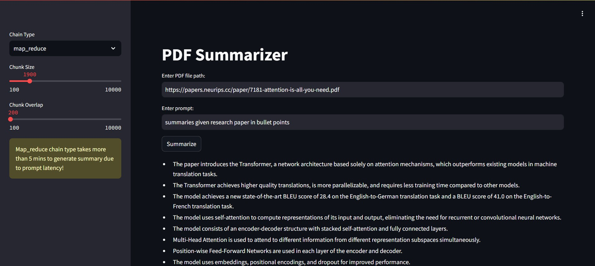

# PDF Summarizer Application

## Overview

This PDF Summarizer application is a Streamlit-based web app that leverages the LangChain library and OpenAI's GPT-3.5-turbo-16k model to summarize PDF documents. Users can customize chunk sizes, overlap, and chain types to generate concise summaries from lengthy documents.



## Features

- Load and process PDF files.
- Split the PDF content into manageable chunks.
- Customize chunk size and overlap for text processing.
- Use different chain types (`map_reduce` and `stuff`) for summarization.
- Input custom prompts for summarization.
- Generate and display summaries on the Streamlit app.

## Prerequisites

- Python 3.8 or higher
- Streamlit
- LangChain
- langchain_community
- OpenAI
- PyPDFLoader
- dotenv

## Installation

1. Clone the repository:

    ```bash
    git clone https://github.com/shirsatritesh/GenAI_PDF_Summarization_with_Langchain
    cd GenAI_PDF_Summarization_with_Langchain
    ```

2. Create and activate a virtual environment:

    ```bash
    python -m venv venv
    source venv/bin/activate  # On Windows use `venv\Scripts\activate`
    ```

3. Install the required packages:

    ```bash
    pip install -r requirements.txt
    ```

4. Set up the OpenAI API key:

    - Create a `.env` file in the root directory of the project.
    - Add your OpenAI API key to the `.env` file:

      ```env
      API_KEY=your_openai_api_key
      ```

## Usage

1. Run the Streamlit app:

    ```bash
    streamlit run app.py
    ```

2. Open your web browser and navigate to the provided local URL (usually `http://localhost:8501`).

3. Use the sidebar to configure the chunk size, chunk overlap, and chain type.

4. Enter the PDF file path and your custom prompt in the main interface.

5. Click the "Summarize" button to generate and display the summary.

## Configuration Options

- **Chain Type**: Choose between `map_reduce` and `stuff` for the summarization chain. Note that `map_reduce` can take longer due to prompt latency.
- **Chunk Size**: Set the size of each text chunk (from 100 to 10000 characters).
- **Chunk Overlap**: Set the overlap size between chunks (from 100 to 10000 characters).

## Example

1. Enter the path to your PDF file.
2. Type in your prompt for the summarization.
3. Click on "Summarize" to view the generated summary.

## Project Structure

- main.py: The main Streamlit application script.
- requirements.txt: A list of required Python packages for the project.
- .env: Configuration file for storing your OpenAI API key.
